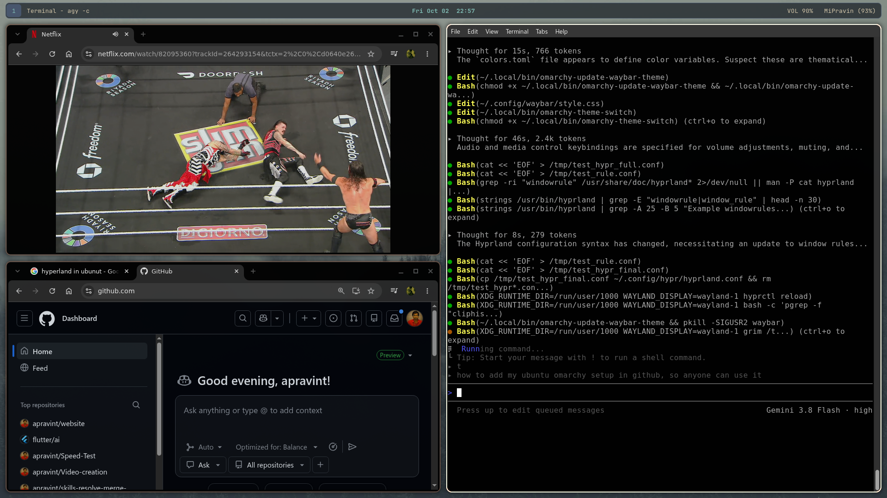

# Omarchy for Ubuntu 🌌

A preconfigured Hyprland desktop environment for Ubuntu LTS featuring sharp geometric tiling, compact window gaps, edge-to-edge Waybar, automated multi-display management, and integrated developer tools.

<div align="center">

[](https://github.com/apravint/omarchy-ubuntu/releases)
[](https://hyprland.org)
[](https://ubuntu.com)
[](https://pipewire.org)
[](LICENSE)

<br/>



</div>

---

## Overview

**Omarchy for Ubuntu** provides an out-of-the-box, fully configured Wayland desktop experience on top of Ubuntu LTS. It packages Hyprland dynamic tiling, a flush edge-to-edge status bar, PipeWire audio routing, automated multi-monitor setup, and 22 switchable color schemes into an easy-to-install setup.

### Key Components

- **Compositor**: [Hyprland](https://hyprland.org) with sharp 90° edges (`rounding = 0`), compact 2px inner window gaps, and fluid dwindle tiling.
- **Status Bar**: [Waybar](https://github.com/Alexays/Waybar) configured edge-to-edge with workspace tabs, CPU/RAM telemetry, active audio sink indicators, weather, and power controls.
- **Application Launcher**: [Wofi](https://hg.sr.ht/~scoopta/wofi) with matching rectangular borders and fuzzy application search.
- **Audio Routing**: [PipeWire](https://pipewire.org) + [WirePlumber](https://gitlab.freedesktop.org/pipewire/wireplumber) policies with 1-click output cycler (`omarchy-audio-toggle`) across HDMI monitors, TVs, analog jacks, and Bluetooth.
- **Display Manager GUI**: `omarchy-displays-gui` utility to detect displays, prevent coordinate overlap, set refresh rates, and persist geometry.
- **Theme Suite**: 22 synchronized color schemes (Tokyo Night, Catppuccin Mocha, Nord, Gruvbox, etc.) switchable on the fly without session restart.
- **Productivity & Utilities**: Integrated clipboard history (`cliphist`), screen snip/recorder, OCR text extractor (`tesseract`), terminal copilot (`??`), and system health checker.

### Agentic OS Architecture

Omarchy implements dedicated system layers for autonomous intelligence, separating tools, memory, retrieval, documents, and execution traces:

- **Tool Server (FastMCP)**: `omarchy-mcp-server` exposes native Hyprland window management, audio controls, display topology, theme switching, and system self-healing over stdio MCP.
- **Dense Vector Retrieval (Qdrant)**: `omarchy-qdrant` runs an embedded on-disk Qdrant database at `~/.local/state/omarchy/qdrant_db`, providing semantic search over repositories and session history without background daemon overhead.
- **Temporal Knowledge Graph (Graphiti)**: `omarchy-graphiti` maintains persistent project knowledge, tracking entities, dependencies, and architectural decisions over time.
- **Live Documentation Scraper (Crawl4AI)**: `omarchy-crawl` extracts web documentation and API references into clean, token-efficient Markdown.
- **Document Ingestion (Docling)**: `omarchy-docling` converts PDFs, Office documents, and presentation slides into structured Markdown tables and text.
- **Code-as-Action Engine (smolagents)**: `omarchy-code-agent` synthesizes and executes atomic Python snippets inside an AST sandbox to perform multi-step desktop tasks in fewer LLM round-trips.
- **Stateful Long Coding Loops (LangGraph)**: `omarchy-workflow` provides cyclic graphs (Plan → Execute → Verify → Self-Heal) with SQLite checkpointing to run long-running refactors and configuration changes safely.
- **Telemetry & Traces (Arize Phoenix)**: `omarchy-trace` logs spans, execution latencies, and error post-mortems, feeding real-time status to the Waybar telemetry HUD.

---

## Installation

### Method 1: Existing Ubuntu Installation (Recommended)

Run the automated installer on an existing Ubuntu 24.04+ (or Debian-based) system:

```bash
# Clone the repository
git clone https://github.com/apravint/omarchy-ubuntu.git
cd omarchy-ubuntu

# Run installer
chmod +x install.sh
./install.sh
```

Or install directly via curl:

```bash
curl -fsSL https://raw.githubusercontent.com/apravint/omarchy-ubuntu/main/install.sh | bash
```

#### After Installation:
1. Log out of your current desktop session.
2. At the display manager login screen (SDDM or GDM), select **Omarchy** (or **Hyprland**).
3. Log in to start the session.

---

### Method 2: Bootable Live ISO

For bare-metal deployment, a bootable ISO image is available:

1. Download the latest `.iso` from [GitHub Releases](https://github.com/apravint/omarchy-ubuntu/releases).
2. Write to a USB drive with [Ventoy](https://www.ventoy.net/), [BalenaEtcher](https://etcher.balena.io/), or `dd`:
   ```bash
   sudo dd if=omarchy-ubuntu-24.04-amd64.iso of=/dev/sdX bs=4M status=progress oflag=sync
   ```
3. Boot the USB drive and select **Start Omarchy for Ubuntu Live**.
   - Default user: `omarchy`
   - Password: `omarchy` (passwordless sudo enabled)

---

## Keyboard Shortcuts

### General & Applications

| Shortcut | Action | Description |
| :--- | :--- | :--- |
| `Super + Return` | **Terminal** | Opens Alacritty terminal |
| `Super + Alt + Return` | **Tmux Terminal** | Opens terminal attached to tmux session |
| `Super + Space` | **App Launcher** | Opens Wofi searchable application launcher |
| `Super + V` | **Clipboard History** | Search and paste clipboard history (`cliphist`) |
| `Super + K` | **Keybindings Menu** | Displays on-screen interactive shortcut cheat sheet |
| `Super + Escape` | **Power Menu** | Lock, Suspend, Reboot, or Shutdown |
| `Super + Ctrl + T` | **Activity Monitor** | Opens `btop` process & resource monitor |

### Window & Workspace Tiling

| Shortcut | Action | Description |
| :--- | :--- | :--- |
| `Super + Q` / `Super + W` | **Close Window** | Closes active window |
| `Super + T` | **Toggle Floating** | Switches focused window between tiling and floating |
| `Super + F` | **Fullscreen** | Toggles true fullscreen mode |
| `Super + O` | **Pin / PiP** | Pins floating window across all workspaces (Picture-in-Picture) |
| `Super + G` | **Toggle Tab Group** | Groups windows into tabbed containers |
| `Super + S` or ``Super + ` `` | **Scratchpad** | Toggles drop-down scratchpad workspace |
| `Super + 1` .. `Super + 0` | **Switch Workspace** | Switch to Workspace 1 through 10 |
| `Super + Shift + 1..0` | **Move Window** | Move focused window to Workspace 1 through 10 |
| `Super + Mouse Drag` | **Move / Resize** | Left-click drag to move; Right-click drag to resize |

### Displays, Audio & Hardware

| Shortcut | Action | Description |
| :--- | :--- | :--- |
| `Super + Ctrl + D` | **Display Settings** | Opens `omarchy-displays-gui` monitor setup panel |
| `Super + Shift + A` | **Cycle Audio Output** | Cycles audio between HDMI, TV, Analog 3.5mm, and Bluetooth |
| `Super + Ctrl + A` | **Volume Mixer** | Opens `pavucontrol` mixer |
| `Super + Ctrl + B` | **Bluetooth Manager** | Opens `blueman-manager` device panel |
| `Super + Ctrl + W` | **Network Settings** | Opens network connection manager |

### Themes & Status Bar

| Shortcut | Action | Description |
| :--- | :--- | :--- |
| `Super + Ctrl + Shift + Space` | **Theme Switcher** | Opens interactive 22-palette theme selector |
| `Super + Ctrl + Space` | **Next Wallpaper** | Cycles wallpaper within active theme |
| `Super + Shift + Space` | **Toggle Top Bar** | Shows / hides Waybar |
| `Super + Ctrl + Shift + B` | **Restart Top Bar** | Restarts Waybar and reloads CSS styles |

### Screenshots, Recording & OCR

| Shortcut | Action | Description |
| :--- | :--- | :--- |
| `Print` or `Super + Shift + S` | **Region Screenshot** | Drag to snip region; saves to `~/Pictures` & clipboard |
| `Alt + Print` | **Screen Recorder** | Start / stop screen recording (`wf-recorder`) |
| `Super + Print` | **Color Picker** | Eyedropper tool to copy hex color (`hyprpicker`) |
| `Super + Ctrl + Print` | **OCR Text Snipper** | Extracts on-screen text directly to clipboard (`tesseract`) |

---

## Included CLI Utilities

All tools are located in `bin/` and automatically installed to `~/.local/bin/` and `/usr/local/bin/`:

| Command | Description |
| :--- | :--- |
| `omarchy-displays-gui` | GTK GUI for configuring monitor positions, resolutions, and refresh rates |
| `omarchy-audio-toggle` | Cycles active default audio sink and moves active playback streams |
| `omarchy-audio-init` | Startup sound service ensuring HDMI/TV outputs are unmuted and persistent |
| `omarchy-theme-switch` | CLI theme selector supporting 22 themes |
| `omarchy-theme-switcher-gui` | GTK GUI theme selector with visual color previews |
| `omarchy-theme-sync-all` | Re-applies active theme palette across Hyprland, Waybar, Wofi, and Mako |
| `omarchy-restart-bar` | Cleanly reloads Waybar with display readiness check |
| `omarchy-health-agent` | Diagnoses failed systemd services, recovers audio daemons, and frees RAM |
| `omarchy-screenshot` | Interactive region screenshot utility |
| `omarchy-screenrecord` | Screen recorder writing MP4 output to `~/Videos` |
| `omarchy-emoji-picker` | Wofi-based searchable emoji selector |
| `omarchy-power-menu` | Fast session power menu (lock, sleep, reboot, shutdown) |
| `omarchy-repo-traffic` | Real-time clone and traffic analytics for GitHub repositories |
| `omarchy-mcp-server` | FastMCP desktop server exposing Hyprland, audio, themes, and memory over stdio MCP |
| `omarchy-qdrant` | Embedded local Qdrant vector retrieval engine for codebase chunks and memory |
| `omarchy-graphiti` | Temporal knowledge graph tracking project decisions, facts, and entity relations |
| `omarchy-crawl` | Documentation scraper powered by Crawl4AI converting web pages to clean markdown |
| `omarchy-docling` | Document parser powered by Docling converting PDFs and Office files to markdown |
| `omarchy-code-agent` | Code-as-action autonomous agent running atomic Python scripts via smolagents |
| `omarchy-workflow` | Stateful coding graph with verification and self-healing loops via LangGraph |
| `omarchy-trace` | Observability and execution traces layer powered by Arize Phoenix |
| `repomix` | Single-file AI context bundler for repositories |
| `?? <query>` | Shell copilot translating plain English queries to bash commands |

---

## Configuration Paths

Configurations are standard dotfiles located in `~/.config/`:

```
~/.config/
├── hypr/
│   ├── hyprland.conf      # Compositor layout, gaps, keybindings, and window rules
│   └── cursor.conf        # Active cursor theme and size
├── waybar/
│   ├── config.jsonc       # Bar modules, ordering, and exec hooks
│   ├── style.css          # Waybar CSS layout and styling
│   └── colors.css         # Active theme color variables
├── wofi/
│   └── style.css          # Application launcher appearance
├── mako/
│   └── config             # Desktop notification styling
└── wireplumber/
    └── wireplumber.conf.d/
        └── 50-hdmi-priority.conf # Audio hardware prioritization rules
```

---

## Building the ISO from Source

To compile the bootable Live ISO from source:

```bash
# Clone the repository
git clone https://github.com/apravint/omarchy-ubuntu.git
cd omarchy-ubuntu

# Run ISO build engine (requires root)
sudo bash build/build-iso.sh
```

Outputs the final ISO and SHA-256 checksum in `out/`.

---

## Uninstallation

To restore original configurations and remove installed scripts:

```bash
cd omarchy-ubuntu
./uninstall.sh
```

## ⚖️ License & Trademarks

This project is licensed under the **[MIT License](LICENSE)**.

### Attributions & Upstream Projects
- **Base OS**: [Ubuntu LTS](https://ubuntu.com) by Canonical Ltd.
- **Upstream Omarchy**: Originally created by [David Heinemeier Hansson](https://github.com/omacom/omarchy) under the MIT License.
- **Compositor**: [Hyprland](https://hyprland.org) by Vaxry and contributors (BSD-3-Clause).
- **Status Bar**: [Waybar](https://github.com/Alexays/Waybar) by Alexays and contributors (MIT).
- **Audio Routing**: [PipeWire](https://pipewire.org) & [WirePlumber](https://gitlab.freedesktop.org/pipewire/wireplumber) (MIT / LGPL).

### Legal & Trademark Disclaimers
- **Ubuntu** is a registered trademark of **Canonical Ltd.** This project is an independent community project and is not affiliated with, sponsored by, or endorsed by Canonical Ltd. The name "Ubuntu" is used strictly in a nominative, descriptive sense to indicate operating system compatibility.
- **Omarchy** is an independent project originally authored by David Heinemeier Hansson. This repository provides an adaptation for Ubuntu LTS and is not an official release of the upstream Omarchy project.
- All other third-party trademarks, product names, logos, and brands mentioned or displayed in this repository are the property of their respective owners. Their inclusion does not imply affiliation or endorsement.
