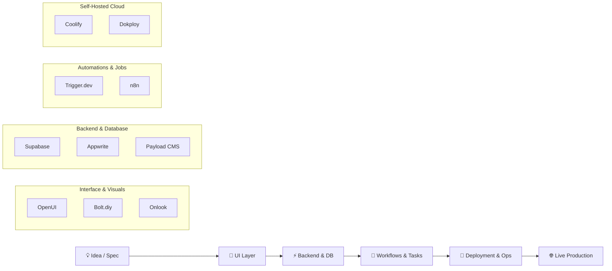

# Autonomous Web Application Stack (Open-Source 2026)

Turn an advanced foundation model (like GPT 6 Astra or Gemini) into an autonomous full-stack engineering engine capable of ideating, building, connecting backends, orchestrating workflows, and operating production web applications.

---

## 🏛️ The End-to-End Architecture



---

## 📦 The 10 Core Repositories

### 1. Interface Generation & Editing
| Tool | Repository | Role & Capabilities |
| :--- | :--- | :--- |
| **OpenUI** | [wandb/openui](https://github.com/wandb/openui) | Generate UI components on the fly from natural language descriptions and real-time visual feedback. |
| **Bolt.diy** | [stackblitz-labs/bolt.diy](https://github.com/stackblitz-labs/bolt.diy) | AI-powered full-stack in-browser web development environment. Prompt, build, run, and modify full applications. |
| **Onlook** | [onlook-dev/onlook](https://github.com/onlook-dev/onlook) | Next-generation visual editor for React applications with bi-directional code sync and AI assistance. |

### 2. Backend & Data Infrastructure
| Tool | Repository | Role & Capabilities |
| :--- | :--- | :--- |
| **Supabase** | [supabase/supabase](https://github.com/supabase/supabase) | Open-source Firebase alternative: Postgres, real-time subscriptions, Auth, Storage, and instant REST/GraphQL APIs. |
| **Appwrite** | [appwrite/appwrite](https://github.com/appwrite/appwrite) | Complete secure backend platform: Auth, DB, serverless Cloud Functions, Webhooks, and file storage. |
| **Payload CMS** | [payloadcms/payload](https://github.com/payloadcms/payload) | Headless TypeScript CMS and native application backend built directly on Next.js/React. |

### 3. Workflow Automation & Background Jobs
| Tool | Repository | Role & Capabilities |
| :--- | :--- | :--- |
| **Trigger.dev** | [triggerdotdev/trigger.dev](https://github.com/triggerdotdev/trigger.dev) | Developer-first background jobs, long-running agent loops, cron triggers, and serverless workflow engine. |
| **n8n** | [n8n-io/n8n](https://github.com/n8n-io/n8n) | Fair-code workflow automation tool connecting hundreds of APIs, agentic nodes, and event-driven webhooks. |

### 4. Self-Hosted Deployment & Operations
| Tool | Repository | Role & Capabilities |
| :--- | :--- | :--- |
| **Coolify** | [coollabsio/coolify](https://github.com/coollabsio/coolify) | Self-hosted all-in-one PaaS alternative to Heroku/Vercel/Netlify for servers, Docker containers, and databases. |
| **Dokploy** | [Dokploy/dokploy](https://github.com/Dokploy/dokploy) | Lightweight, self-hosted deployment platform using Docker & Traefik for automated git pushes and database hosting. |

---

## 🛠️ 3 Production Blueprint Builds

### 1. Autonomous AI SaaS Stack
```text
Bolt.diy ➔ Supabase ➔ Trigger.dev ➔ Coolify
```
* **Use Case:** Launching complete user-facing multi-tenant SaaS products.
* **Workflow:** Bolt.diy scaffolds the React/Next.js frontend and API routes; Supabase handles authentication, multi-tenant Postgres rows, and storage; Trigger.dev handles asynchronous AI model generation jobs and billing webhooks; Coolify runs on a single VPS hosting everything self-contained.

### 2. Autonomous Internal Tools Stack
```text
OpenUI ➔ Appwrite ➔ n8n ➔ Dokploy
```
* **Use Case:** Company dashboards, customer service consoles, and operations tools.
* **Workflow:** OpenUI rapidly generates custom UI components from prompt specs; Appwrite provides role-based access control and datastores; n8n orchestrates external enterprise integrations (Slack, Google Workspace, CRM); Dokploy manages deployment on bare-metal or cloud VMs.

### 3. Headless Content Platform Stack
```text
Onlook ➔ Payload CMS ➔ Trigger.dev ➔ Coolify
```
* **Use Case:** High-performance marketing sites, editorial networks, digital publishing.
* **Workflow:** Designers visually tune layouts with Onlook; Payload CMS powers native TypeScript content schemas; Trigger.dev handles image optimization, indexing, and RSS/social syndication; Coolify provides zero-downtime rolling deploys.
