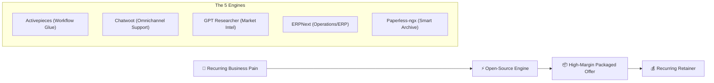

# 5 Turnkey Open-Source Business Engines

Turn open-source repositories into high-margin client services and turnkey agency offers. 

> **The Core Business Proposition:**
> *"A client can download the code themselves. Getting it configured, integrated, secured, trained, and operated inside their business is the part you can package and sell."*

---

## 🏛️ The 5-Minute Offer Framework

---

## 📦 The 5 Core Repositories & Client Offers

### 1. Activepieces — Workflow Automation & App Synchronization
* **Repository**: [activepieces/activepieces](http://github.com/activepieces/activepieces)
* **The Client Problem**: Staff spending hours copy-pasting data between CRM, email, spreadsheets, and accounting tools; paying exorbitant Zapier/Make subscription tiers.
* **The Packaged Offer**:
  * **Deliverable**: Self-hosted Activepieces instance on a VPS with customized automation flows.
  * **Offer Title**: *"Zero-SaaS-Fee Workflow Automation Pipeline"*.
  * **Business Model**: Setup fee ($1,500 – $4,000) + Ongoing monthly maintenance & new flow retainer ($300 – $800/mo).

### 2. Chatwoot — Omnichannel Customer Support & Live Chat
* **Repository**: [chatwoot/chatwoot](http://github.com/chatwoot/chatwoot)
* **The Client Problem**: Customer messages scattered across WhatsApp, Instagram DMs, website live chat, and support emails with zero shared team inbox.
* **The Packaged Offer**:
  * **Deliverable**: Centralized support inbox connecting WhatsApp Business API, website widget, team auto-routing, and knowledge base.
  * **Offer Title**: *"Unified Customer Support Command Center"*.
  * **Business Model**: Setup & integration fee ($2,000 – $5,000) + SLA hosting & bot tuning ($400 – $1,000/mo).

### 3. GPT Researcher — Autonomous Competitive & Market Intelligence
* **Repository**: [assafelovic/gpt-researcher](http://github.com/assafelovic/gpt-researcher)
* **The Client Problem**: Founders and executives needing recurring competitor updates, regulatory briefs, or industry deep-dives without spending 20+ hours compiling research.
* **The Packaged Offer**:
  * **Deliverable**: Automated autonomous research agent producing weekly fact-checked PDF synthesis briefs on competitors and market shifts.
  * **Offer Title**: *"Executive Market Intelligence Radar"*.
  * **Business Model**: Monthly subscription deliverable ($500 – $2,500/mo per client).

### 4. ERPNext — Full Business Operations & Accounting Beyond Spreadsheets
* **Repository**: [frappe/erpnext](http://github.com/frappe/erpnext)
* **The Client Problem**: Inventory, invoices, payroll, and purchase orders managed across dozens of brittle, disconnected Google Sheets.
* **The Packaged Offer**:
  * **Deliverable**: Complete cloud-hosted ERP migration, inventory tracking, role-based employee access, and invoicing setup.
  * **Offer Title**: *"Spreadsheet-to-ERP Migration & Operations Suite"*.
  * **Business Model**: Implementation project ($5,000 – $20,000) + Managed cloud hosting, backups, and user training retainer ($800 – $2,000/mo).

### 5. Paperless-ngx — Document Archiving & AI OCR Indexing
* **Repository**: [paperless-ngx/paperless-ngx](http://github.com/paperless-ngx/paperless-ngx)
* **The Client Problem**: Legal firms, clinics, or accounting offices drowning in paper receipts, vendor invoices, and unsearchable scanned PDFs.
* **The Packaged Offer**:
  * **Deliverable**: Auto-consuming scanner setup that applies Tesseract OCR, tags documents, extracts invoice amounts, and enables full-text search.
  * **Offer Title**: *"Paperless Digital Archive & Auto-Indexing Pipeline"*.
  * **Business Model**: Hardware/scanner setup & historical migration ($2,500 – $7,500) + Encrypted backup management ($350 – $750/mo).

---

## 💡 The Agency Playbook

1. **Pick One Niche**: Don't sell all five at once. Pick *one* (e.g., Paperless for accounting firms, or Activepieces for real-estate agencies).
2. **Build One Working Demo**: Spin up a Dockerized instance on Coolify or Dokploy with sample client data.
3. **Validate Demand**: Show the working prototype before building custom sales funnels.
