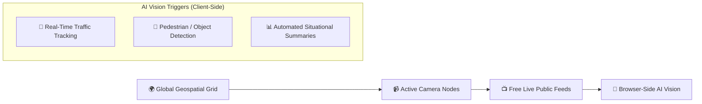

# OSIRIS (OI Assist) — Global CCTV & AI Vision Intelligence

An autonomous geospatial platform and open-source intelligence (OSINT) engine that locates active global cameras, streams public CCTV feeds, and executes client-side computer vision models.

---

## 🌐 Platform Links

* **Live Terminal**: [https://osirisai.live](https://osirisai.live)
* **GitHub Repository**: [simplifaisoul/osiris](https://github.com/simplifaisoul/osiris)

---

## 👁️ Core Capabilities

### 1. Free & Keyless Public CCTV Streams
* Flies dynamically across the globe to locate nearby active camera nodes.
* Access core public infrastructure cameras and traffic streams with zero API keys and zero cost.

### 2. Client-Side AI Vision Engine
* **Privacy First**: Enter your vision LLM / model API keys directly in the web browser.
* Keys remain strictly client-side in the browser and are dispatched directly to the inference endpoint per request.
* Powers automated situational summaries, vehicle counting, flow congestion analysis, and anomaly identification.

---

## 🛠️ Applications for IRAM OS & Autonomous Agents

* **Geospatial & Situational Awareness**: Can be paired with `iram-vision` or agentic web scrapers for real-time environmental monitoring.
* **Open Source Intelligence (OSINT)**: Automated visual intelligence gathering without infrastructure overhead.
