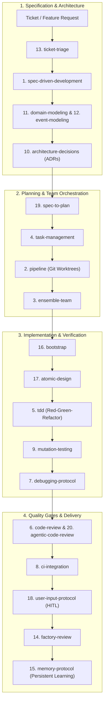

# The 20 Agent Skills for an Autonomous Software Factory

A complete capability taxonomy and skill catalog to turn autonomous AI coding agents (Antigravity, Claude Code, Cursor, Copilot Workspace) into a rigorous, production-grade **Autonomous Software Factory**.

---

## 🏛️ End-to-End Factory Workflow

---

## 📋 The 20 Core Skills Catalog

| # | Skill | Repository Link | Core Capability & Role in Factory |
| :-: | :--- | :--- | :--- |
| **01** | **spec-driven-development** | [magnus919/agent-skills](https://github.com/magnus919/agent-skills/tree/main/spec-driven-development) | Converts fuzzy product requirements into formal specifications, acceptance criteria, and verifiable deliverables. |
| **02** | **pipeline** | [jwilger/agent-skills](https://github.com/jwilger/agent-skills/tree/main/skills/pipeline) | Orchestrates plan → build → review pipelines with strict quality gates and isolated Git worktree sandboxes. |
| **03** | **ensemble-team** | [jwilger/agent-skills](https://github.com/jwilger/agent-skills/tree/main/skills/ensemble-team) | Coordinates multi-agent specialist teams (architect, developer, test engineer, security auditor). |
| **04** | **task-management** | [jwilger/agent-skills](https://github.com/jwilger/agent-skills/tree/main/skills/task-management) | Deconstructs monolithic features into DAG dependency tasks with explicit ownership and progress tracking. |
| **05** | **tdd** | [jwilger/agent-skills](https://github.com/jwilger/agent-skills/tree/main/skills/tdd) | Enforces test-driven development via strict automated Red-Green-Refactor cycles before writing production code. |
| **06** | **code-review** | [jwilger/agent-skills](https://github.com/jwilger/agent-skills/tree/main/skills/code-review) | Audits AI-generated diffs for specification compliance, maintainability, performance, and domain rules. |
| **07** | **debugging-protocol** | [jwilger/agent-skills](https://github.com/jwilger/agent-skills/tree/main/skills/debugging-protocol) | Systematically formulates hypotheses, analyzes stack traces, isolates root causes, and verifies bug fixes. |
| **08** | **ci-integration** | [jwilger/agent-skills](https://github.com/jwilger/agent-skills/tree/main/skills/ci-integration) | Integrates automated build validation, regression testing, and quality gating directly into CI pipelines. |
| **09** | **mutation-testing** | [jwilger/agent-skills](https://github.com/jwilger/agent-skills/tree/main/skills/mutation-testing) | Tests the quality of test suites by introducing intentional code mutations to verify tests fail when expected. |
| **10** | **architecture-decisions** | [jwilger/agent-skills](https://github.com/jwilger/agent-skills/tree/main/skills/architecture-decisions) | Formats and commits Architectural Decision Records (ADRs) to eliminate repetitive decision re-evaluation. |
| **11** | **domain-modeling** | [jwilger/agent-skills](https://github.com/jwilger/agent-skills/tree/main/skills/domain-modeling) | Constructs type-driven domain entities and encapsulates business invariants into type systems. |
| **12** | **event-modeling** | [jwilger/agent-skills](https://github.com/jwilger/agent-skills/tree/main/skills/event-modeling) | Maps event-sourced architectures, domain state transitions, command flows, and acceptance timelines. |
| **13** | **ticket-triage** | [jwilger/agent-skills](https://github.com/jwilger/agent-skills/tree/main/skills/ticket-triage) | Evaluates ambiguous bug reports and feature tickets, extracting reproduction steps and acceptance gates. |
| **14** | **factory-review** | [jwilger/agent-skills](https://github.com/jwilger/agent-skills/tree/main/skills/factory-review) | Macro-level factory governance evaluating agent velocity, test coverage, static analysis, and human sign-off. |
| **15** | **memory-protocol** | [jwilger/agent-skills](https://github.com/jwilger/agent-skills/tree/main/skills/memory-protocol) | Stores and retrieves architectural context, conventions, and previous debugging lessons across sessions. |
| **16** | **bootstrap** | [jwilger/agent-skills](https://github.com/jwilger/agent-skills/tree/main/skills/bootstrap) | Automatically initializes new repositories, detects toolchains, configures linters, and scaffolds instructions. |
| **17** | **atomic-design** | [jwilger/agent-skills](https://github.com/jwilger/agent-skills/tree/main/skills/atomic-design) | Standardizes UI component generation using Atoms → Molecules → Organisms → Templates hierarchy. |
| **18** | **user-input-protocol** | [jwilger/agent-skills](https://github.com/jwilger/agent-skills/tree/main/skills/user-input-protocol) | Prompts humans for critical design choices or credentials without corrupting active agent loop state. |
| **19** | **spec-to-plan** | [artreimus/software-factory-starter](https://github.com/artreimus/software-factory-starter/tree/main/.agents/skills/spec-to-plan) | Transforms approved PRDs and specifications into granular, step-by-step engineering execution plans. |
| **20** | **agentic-code-review** | [artreimus/software-factory-starter](https://github.com/artreimus/software-factory-starter/tree/main/.agents/skills/agentic-code-review) | Automated multi-pass code reviewer running linting, AST inspection, security auditing, and structured diff commentary. |

---

## 🚀 How to Load in IRAM OS & Antigravity

These skills can be imported into:
- `~/.agents/skills/<skill-name>/SKILL.md` for global agent execution.
- Project-level `.agents/skills/<skill-name>/SKILL.md` for repository-specific workflows.
